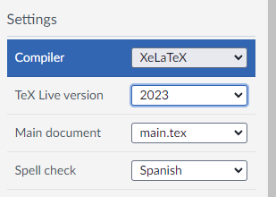

# Escribir Descripción Técnica de Proyectos PICT en LaTeX

Este es un esqueleto básico LaTeX para Descripción Técnica de Proyectos PICT (Agencia I+D+i, Argentina). Pueden forkear el repo, subirlo a Overleaf, usarlo en instalaciones locales de TexLive, etc. 

## El paso a paso

1. Editar `settings/variables.tex` 
  - Nombre y Apellido del IR
  - Titulo del proyecto
  - Codigo del PICT
  - Palabras clave
  - Institución Beneficiaria
2. Agregar tu archivo de referencias bibliograficas (.bib) y mencionarlo en `settings/bibliography.tex`. Ahora mismo hay un `sample.bib` minimo de ejemplo. 
3. Opcional: editar `settings/colors.tex` y elegir colores para links, texto de secciones, etc.
4. Opcional: editar `settings/fonts.tex` y elegir tipografia para texto + encabezados.
5. Opcional: editar `settings/page.tex` y modificar espacio entre parrafos, margenes, etc.
6. Escribir el proyecto 😏
  - el contenido está separado en diferentes archivos .tex de input
7. Compilar con XeLaTeX (testeado)

### Con latexmk
`latexmk -xelatex descripcion-tecnica.tex`

### En Overleaf: 
 * Menu -> Settings -> Compiler = XeLaTeX
 * Menu -> Settings -> TeX Live version = 2023 o superior (testeado con 2024)

 ### En Visual Studio Code:
  * Es más complejo
  * Instalar LateX Studio Workshop
  * Revisar *recipes* (usan latexmk)
  * Usar magic `! TeX` commands at the top of root file (descripcion-tecnica.tex)
    - Por ahi requiere activar algun setting en preferencias
  * Puede fallar y requerir algo mas de prueba y error. 

El PDF ajunto muestra como queda más o menos el asunto. 

Enjoy!

